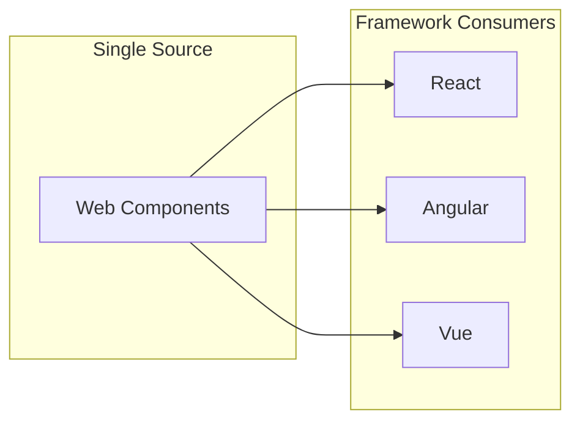
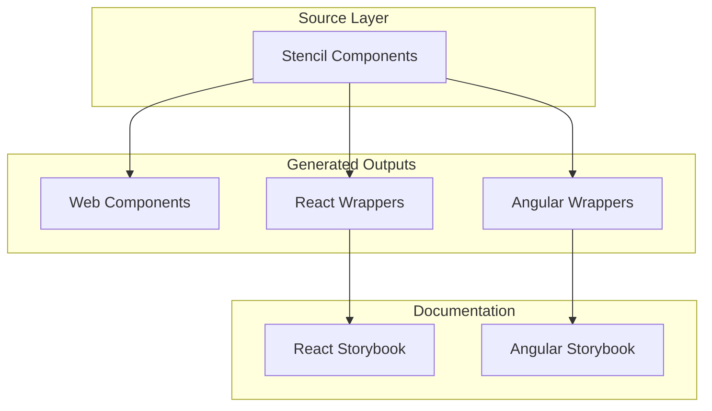

## What is a Design System?

If you're new to design systems, think of them as a **shared library of rules and building blocks** that teams use to build user interfaces. A design system is more than just a component library—it includes visual design guidelines, interaction patterns, accessibility standards, and the actual code implementations. It's like a style guide that lives and breathes in your codebase.

Imagine every developer on your team building buttons differently—different colors, sizes, hover effects. Without a design system, you get inconsistency, duplicated code, and a fragmented user experience. With one, everyone uses the same `nucleus-button` component and the product feels cohesive.

Industry-leading examples include **Material Design** (Google), **Fluent UI** (Microsoft), **Carbon** (IBM), and **Ant Design** (Alibaba). These systems improve consistency, accelerate development, and ensure accessibility compliance. When done well, a design system becomes the single source of truth for how your products look, feel, and behave.

## The Framework Problem Every Team Faces

Most organizations use multiple frontend frameworks across their products—React for customer-facing apps, Angular for internal tools, Vue for marketing sites. The old approach was to maintain separate component libraries: one for React, one for Angular, one for Vue. This leads to:

- **Triple the work**: The same button implemented three times
- **Subtle drift**: Bug fixes and improvements must be applied everywhere
- **Inconsistent updates**: Different frameworks evolve at different speeds
- **Designer frustration**: "Why does the button look different in our admin app?"

This is where **web components** change the equation entirely.

## Why Web Components as the Foundation?

Web components are browser-native custom HTML elements. They're built on four web standards: **Custom Elements** (define your own tags like `<nucleus-button>`), **Shadow DOM** (optional style encapsulation), **HTML Templates**, and **ES Modules**. The key insight: build your component library **once** as web components, then consume it everywhere—React, Angular, Vue, vanilla JavaScript, or frameworks that don't exist yet. This is the "write once, run anywhere" promise realized at the UI layer.

## Enter Stencil.js

Stencil is a **compiler**, not a framework. It transforms TypeScript and JSX into optimized, standards-compliant web components with zero runtime dependencies. Built by the Ionic team, Stencil provides JSX syntax, TypeScript-first development, and—crucially—**output targets** that auto-generate idiomatic React and Angular wrappers. You write components once; Stencil produces both the web components and framework-specific adapters. React developers get proper React components with TypeScript props; Angular developers get proper directives. Everyone wins.

## The Nucleus Architecture

Nucleus uses a layered architecture. At the core, Stencil components live in `packages/nucleus`. When you build, Stencil compiles these to web components and **simultaneously** generates React and Angular wrapper code. The wrappers aren't hand-written—they're generated from the same source, so they're always in sync.

- **Core layer** (`packages/nucleus`): Stencil components with SCSS styling and design tokens
- **Wrapper layers**: Auto-generated React and Angular adapters
- **Documentation layers**: Dual Storybooks so both React and Angular developers see framework-appropriate examples

## What You'll Build in This Series

By following this series, you'll build a production-ready design system with:

- **15+ reusable components**: buttons, inputs, dropdowns, pills, multiselect, accordions, headers, footers
- **SCSS design token system** with runtime theming via CSS custom properties
- **Automatic React wrappers** with full TypeScript support
- **Automatic Angular wrappers** integrated with Angular modules
- **Dual Storybook documentation** showing both frameworks side-by-side
- **Monorepo tooling** with Nx for build orchestration and caching
- **Azure deployment** with Bicep infrastructure-as-code and protected hosting

## Who This Series Is For

This series assumes you have basic TypeScript knowledge, familiarity with CSS/SCSS, and have used React or Angular before (you don't need to be an expert). You should be comfortable with npm and the command line. By the end, you'll understand not just how to build components, but how to architect a scalable, maintainable design system that works across framework boundaries.

## Next Up

In Part 2, we'll set up the monorepo structure, configure npm workspaces with Nx orchestration, and establish the build dependency graph that makes this architecture work.
