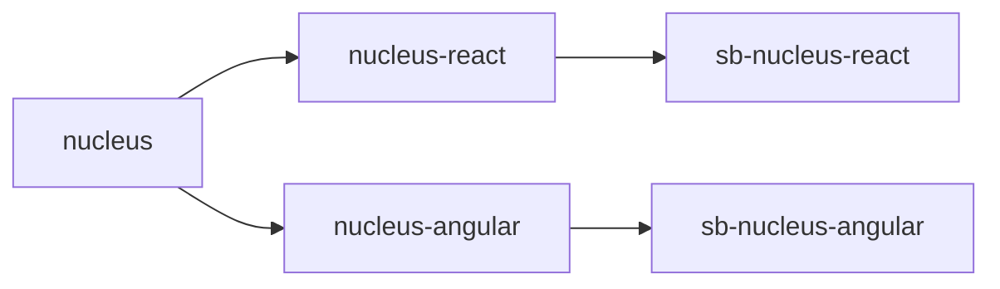
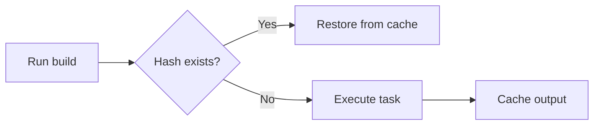

## Why Monorepos for Design Systems?

A **monorepo** (short for monolithic repository) keeps all related packages in a single Git repository with shared tooling and versioning. For design systems, this is essential. When you fix a bug in `nucleus-button`, you want the React wrapper, Angular wrapper, and both Storybooks to update in the **same commit**. No version mismatches, no "which version of the core does the React package use?"—everything stays in sync.

Companies like Google, Meta, and Microsoft use monorepos to manage thousands of projects. We use the same approach at a smaller scale for Nucleus.

## NPM Workspaces: The Foundation

NPM workspaces (built into npm 7+) provide native monorepo support. In your root `package.json`:

```json
{
  "workspaces": ["packages/*"]
}
```

This tells npm that every folder under `packages/` is a workspace package. Benefits you'll notice immediately:

- **Hoisted dependencies**: Shared packages like `typescript` are installed once at the root `node_modules/`
- **Symlinked packages**: When `nucleus-react` depends on `nucleus`, npm creates a symlink so you're always testing against your local source
- **Workspace commands**: Run scripts across all packages with `npm run build -w nucleus` or `npm run build --workspaces`

## The Nucleus Package Structure

Each package has a clear responsibility. The dependency flow is one-way: core → wrappers → Storybooks.



- **`nucleus/`**: Stencil component source. Builds to `dist/` with compiled web components and CSS.
- **`nucleus-react/`**: Auto-generated React proxy components. Never edit these files—Stencil regenerates them.
- **`nucleus-angular/`**: Auto-generated Angular directives. Same rule: auto-generated only.
- **`sb-nucleus-react/`** and **`sb-nucleus-angular/`**: Storybook apps for documentation. They consume the wrapper packages.

The key insight: during development, workspace symlinks mean you always test against your latest code. No need to `npm publish` and reinstall to see changes.

## Nx: Intelligent Build Orchestration

npm workspaces handle **linking**; Nx handles **execution order**. Without Nx, you'd have to remember to build `nucleus` before `nucleus-react`, and `nucleus-react` before `sb-nucleus-react`. Nx reads your `package.json` dependencies and builds in the correct order automatically.

Configure `nx.json` with target defaults:

```json
{
  "targetDefaults": {
    "build": {
      "dependsOn": ["^format", "^lint", "^build"]
    }
  }
}
```

The `^` prefix means "run this target on all dependencies first." So when you run `npm run build`, Nx builds `nucleus`, then `nucleus-react` and `nucleus-angular`, then the Storybooks—in parallel where possible.

## Caching: Why Your Second Build Is Instant

Nx hashes task inputs (source files, config, dependencies) to create cache keys. When you run a build, Nx checks: "Have I run this exact task before?" If the hash matches a previous run, it restores the output from cache and skips execution. Your second `npm run build` after no changes can complete in seconds instead of minutes.



On CI, this compounds: if only `nucleus-button` changed, only affected packages rebuild. Unchanged packages restore from cache.

## Package Dependencies in Practice

Each package declares dependencies in its `package.json`. The React wrapper, for example:

```json
{
  "dependencies": {
    "nucleus": "workspace:*",
    "react": "^18.0.0"
  }
}
```

The `workspace:*` protocol tells npm to use the local workspace package during development. When you publish to npm, build tools replace this with the actual version number.

## Folder Structure Walkthrough

From the repository root:

```
nucleus/
├── packages/
│   ├── nucleus/              # Core Stencil components
│   ├── nucleus-react/        # React wrappers (auto-generated)
│   ├── nucleus-angular/      # Angular wrappers (auto-generated)
│   ├── sb-nucleus-react/     # React Storybook
│   ├── sb-nucleus-angular/   # Angular Storybook
│   └── nucleus-dev-docs/     # Docusaurus dev docs
├── infra/                    # Azure Bicep templates
├── scripts/                  # Build/deploy helpers
└── docs/                     # This Jekyll blog
```

The build graph ensures artifacts are always in sync—you can't accidentally deploy Storybook pointing at outdated wrapper code.

## Verification Steps

After cloning the repo:

```bash
npm install
npm run build
```

If both succeed, your monorepo is wired correctly. Run `npm run storybook` to start both Storybooks and see your components in action.

## Next Steps

In Part 3, we'll dive into Stencil.js—how components are authored, the decorator model, lifecycle hooks, and output targets in detail.
