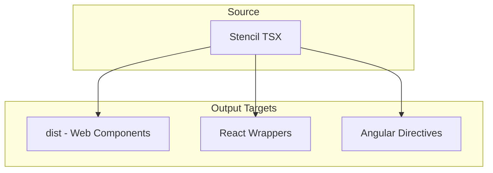
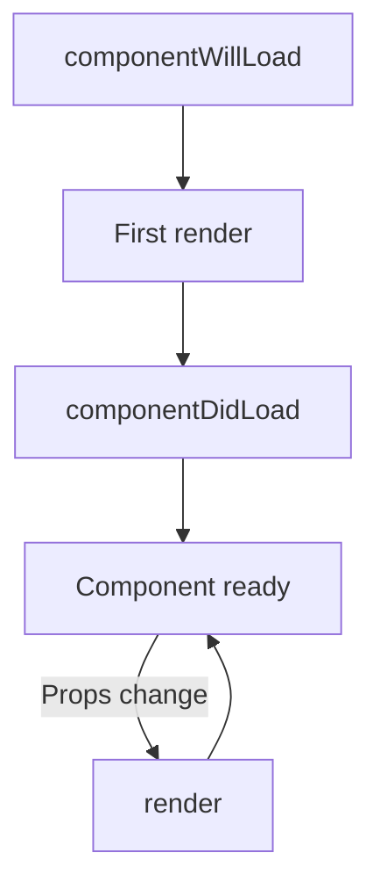

## What is Stencil.js?

Stencil is a **compiler**, not a framework. It transforms TypeScript and JSX into vanilla JavaScript web components that run in browsers with zero runtime dependencies. There's no "Stencil runtime" to ship—it compiles away. Think of it as a specialized build tool for web components, similar to how Babel transforms modern JavaScript.

Created by the Ionic team, Stencil powers Ionic Framework and is used by companies like Apple, Amazon, and Microsoft for design systems. The key differentiator: you write components that feel like React (JSX, TypeScript, decorators), and Stencil outputs standards-compliant custom elements.

## Stencil Config Walkthrough

The `packages/nucleus/stencil.config.ts` file controls everything:

```typescript
export const config: Config = {
  namespace: 'nucleus',
  taskQueue: 'async',
  globalStyle: './src/styles/styles.scss',
  outputTargets: [/* ... */],
  plugins: [sass()]
};
```

- **`namespace`**: Affects bundle filenames (e.g., `nucleus.js`). Prevents collisions if multiple Stencil libraries load on the same page.
- **`taskQueue: 'async'`**: How Stencil batches DOM updates for performance.
- **`globalStyle`**: Entry point for design tokens and global CSS. Compiled once into `dist/nucleus/nucleus.css`.

## Output Targets: What Stencil Produces



**`dist` target**: Generates lazy-loaded ES modules, type definitions, and the global stylesheet. This is what consumers import.

**`reactOutputTarget`**: Auto-generates React components in `nucleus-react`. Maps Stencil events to React props (e.g., `nucleusChange` → `onNucleusChange`).

**`angularOutputTarget`**: Auto-generates Angular directives with `@ProxyCmp`. Integrates with NgModule and change detection.

## The Decorator Model Explained

Stencil uses TypeScript decorators to add behavior. If you've used Angular or class-based React, these will feel familiar.

### @Component

Defines the custom element:

```typescript
@Component({
  tag: 'nucleus-button',
  styleUrl: 'nucleus-button.scss',
  shadow: false
})
```

- **`tag`**: The HTML element name. Must contain a hyphen per the web components spec.
- **`shadow: false`**: We use Light DOM so global design tokens apply. Shadow DOM would encapsulate styles.

### @Prop — Public Properties

```typescript
@Prop() type: 'primary' | 'secondary' = 'primary';
@Prop({ reflect: true }) disabled: boolean = false;
```

Props are reactive: when a parent updates the attribute, the component re-renders. `reflect: true` syncs the value back to the HTML attribute, useful for CSS selectors like `button[disabled]`.

### @State — Internal State

```typescript
@State() isOpen: boolean = false;
```

Use `@State` for internal UI state (dropdown open/closed, etc.). Not exposed to consumers.

### @Event — Custom Events

```typescript
@Event() nucleusChange: EventEmitter<string>;
// In handler: this.nucleusChange.emit(newValue);
```

Consumers listen with `onNucleusChange` (React) or `(nucleusChange)="handler($event)"` (Angular).

### @Watch — React to Changes

```typescript
@Watch('value')
valueChanged(newVal: string, oldVal: string) {
  this.validateInput(newVal);
}
```

Runs when a prop or state changes. Useful for validation, syncing derived state, or side effects.

## Component Lifecycle (Simplified)



- **`componentWillLoad`**: Once, before first render. Fetch data, initialize state.
- **`componentDidLoad`**: Once, after first render. Access DOM, attach listeners.
- **`render`**: Called whenever props or state change. Return JSX.

## Shadow DOM vs Light DOM

**Shadow DOM** (`shadow: true`): Fully encapsulated. Page CSS can't leak in. Better for third-party widgets.

**Light DOM** (`shadow: false`): Global styles apply. Easier theming with CSS custom properties. Nucleus uses this so design tokens flow through without piercing shadow boundaries.

## Next Steps

Part 4 walks through building `nucleus-button` from scratch—props, styles, tests, and verification.
