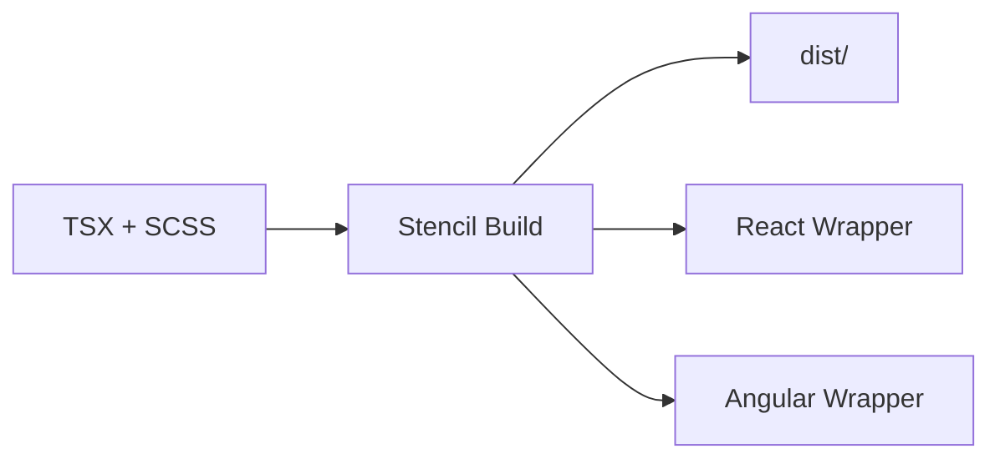

## Component-Driven Development

Let's build `nucleus-button`—the foundational component of any design system. A well-designed button demonstrates all core concepts: props for variants, event handling, accessibility, and styling with design tokens. If you're new to component development, think of this as building a reusable Lego block that other developers will use everywhere.

## Anatomy of a Stencil Component

Every Stencil component needs:

1. **A TypeScript class** with the `@Component` decorator
2. **A `render()` method** that returns JSX
3. **A stylesheet** (`.scss` for Nucleus)
4. **Unit tests** (`.spec.tsx`)

Optional: E2E tests in `test/` for browser-level validation.

## Step 1: Generate the Component Scaffold

From the `packages/nucleus` directory:

```bash
npx stencil generate
# Choose: component
# Name: nucleus-button
```

This creates the folder structure, base files, and a spec file. Don't worry about getting everything perfect—you'll replace most of the boilerplate.

## Step 2: Define Props and the Public API

Props are the component's contract with the outside world. Keep the API minimal and semantic.

```typescript
@Component({
  tag: 'nucleus-button',
  styleUrl: 'nucleus-button.scss',
  shadow: false
})
export class NucleusButton {
  @Prop() type: 'primary' | 'secondary' = 'primary';
  @Prop() size: 'xs' | 'sm' | 'md' | 'lg' | 'xl' = 'md';
  @Prop() rounded: boolean = false;
  @Prop({ reflect: true }) disabled: boolean = false;

  render() {
    return (
      <button
        type="button"
        class={classNames('btn', {
          [`btn-${this.type}`]: true,
          rounded: this.rounded,
          disabled: this.disabled,
          [`btn-${this.size}`]: true
        })}
        disabled={this.disabled}
      >
        <slot />
      </button>
    );
  }
}
```

**Design decisions**:

- **`type`**: Primary vs secondary conveys intent. Designers understand "primary" means the main action.
- **`size`**: Aligns with typography scale (xs through xl).
- **`<slot />`**: Projects child content—text, icons—from the consumer. Essential for flexibility.
- **`classNames`**: The `classnames` library composes CSS classes from prop values cleanly.

## Step 3: Add SCSS Styles with Tokens

Never hardcode colors or spacing. Use design tokens:

```scss
@use '../../styles/tokens' as tokens;

.btn {
  font-family: var(--nucleus-font-family-sans);
  padding: var(--nucleus-spacing-2) var(--nucleus-spacing-4);
  border-radius: var(--nucleus-radius-md);
  cursor: pointer;

  &.btn-primary {
    background-color: var(--nucleus-color-primary);
    color: var(--nucleus-color-white);
  }

  &.btn-secondary {
    background-color: transparent;
    border: 1px solid var(--nucleus-border-color);
    color: var(--nucleus-color-primary);
  }

  &.btn-disabled {
    opacity: 0.6;
    cursor: not-allowed;
  }
}
```

The `var(--nucleus-*)` pattern means consumers can override these at runtime for theming—without recompiling your library.

## Step 4: Write Unit Tests

Use Stencil's `newSpecPage()` for fast, isolated tests:

```typescript
import { newSpecPage } from '@stencil/core/testing';
import { NucleusButton } from './nucleus-button';

describe('nucleus-button', () => {
  it('renders with default props', async () => {
    const page = await newSpecPage({
      components: [NucleusButton],
      html: '<nucleus-button>Click me</nucleus-button>'
    });
    const button = page.root?.querySelector('button');
    expect(button?.classList.contains('btn-primary')).toBe(true);
  });

  it('reflects disabled to attribute', async () => {
    const page = await newSpecPage({
      components: [NucleusButton],
      html: '<nucleus-button disabled>Click</nucleus-button>'
    });
    expect(page.root?.hasAttribute('disabled')).toBe(true);
  });
});
```

Run tests with `npm run test -w nucleus`. Tests should be fast—no real browser required for most spec tests.

## Step 5: Build and Verify

```bash
npm run build -w nucleus
```

Inspect `packages/nucleus/dist/`. You'll find compiled JavaScript, type definitions, and `nucleus.css`. The build also regenerates React and Angular wrappers—so `nucleus-react` and `nucleus-angular` now expose `NucleusButton`.



## Best Practices for Junior Developers

1. **Start with props**: Define the minimal API. Fewer props = simpler component.
2. **Use semantic names**: `type="primary"` beats `variant="blue"`.
3. **Provide defaults**: Every prop should have a sensible default.
4. **Reflect boolean props**: Enables CSS `[disabled]` selectors.
5. **Test as you go**: Don't defer tests until the end.

## Next Steps

In Part 5, we'll establish the SCSS design token system—colors, spacing, typography, borders—that powers consistent styling across all components.
