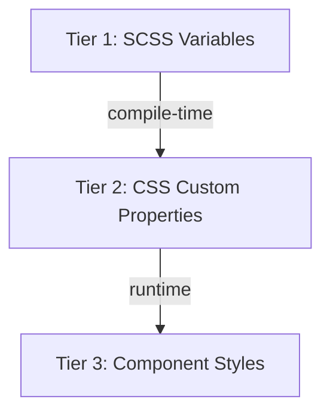

## What Are Design Tokens?

Design tokens are **atomic design decisions stored as code**. Instead of hardcoding `#3b82f6` in every button and input, you define `$nucleus-color-primary` once. When the brand color changes, update one variable—all components update automatically. Tokens cover colors, spacing, typography, shadows, borders, and more.

Major design tools (Figma, Sketch, Adobe XD) now export tokens, enabling true design-to-code workflows. Nucleus uses SCSS variables and CSS custom properties to achieve this.

## The Three-Tier Token Architecture

Nucleus uses a layered approach. Each tier has a specific role:



### Tier 1: SCSS Variables with !default

Located in `packages/nucleus/src/styles/tokens/`:

```scss
// tokens/_colors.scss
$nucleus-color-primary: #1fb6ff !default;
$nucleus-color-primary-hover: #2b6cb0 !default;
$nucleus-color-gray-100: #f3f4f6 !default;
```

The `!default` flag means "use this value unless overridden before import." This lets consumers customize themes by defining variables before importing your styles. Token files are organized by category: `_colors.scss`, `_spacing.scss`, `_typography.scss`, `_borders.scss`, `_shadows.scss`, `_transitions.scss`, `_z-index.scss`.

### Tier 2: CSS Custom Properties

The file `_custom-properties.scss` maps SCSS variables to CSS custom properties on `:root`:

```scss
:root {
  --nucleus-color-primary: #{$nucleus-color-primary};
  --nucleus-color-primary-hover: #{$nucleus-color-primary-hover};
  --nucleus-spacing-2: #{$nucleus-spacing-2};
  --nucleus-radius-md: #{$nucleus-radius-md};
}
```

Why this layer? **Runtime theming**. Unlike SCSS variables (compile-time only), CSS custom properties can be changed via JavaScript without recompiling:

```javascript
document.documentElement.style.setProperty('--nucleus-color-primary', '#e63946');
```

The entire UI rebrands instantly. Essential for dark mode, A/B theming, or white-label products.

### Tier 3: Component Consumption

Components use `var()` to reference tokens:

```scss
.btn-primary {
  background-color: var(--nucleus-color-primary);
  padding: var(--nucleus-spacing-2) var(--nucleus-spacing-4);
  border-radius: var(--nucleus-radius-md);
}
```

## Token Naming Convention

Consistency helps developers find tokens without constant documentation lookup:

| Category | Pattern | Example |
|----------|---------|---------|
| Colors | `--nucleus-color-{name}` | `--nucleus-color-primary` |
| Spacing | `--nucleus-spacing-{size}` | `--nucleus-spacing-4` |
| Typography | `--nucleus-font-{property}` | `--nucleus-font-size-sm` |
| Borders | `--nucleus-radius-{size}` | `--nucleus-radius-lg` |

## Reusable SCSS Mixins

Mixins encode common patterns so you apply them consistently:

```scss
// mixins/_focus.scss
@mixin focus-ring {
  outline: 2px solid var(--nucleus-color-primary);
  outline-offset: 2px;
}

// mixins/_disabled.scss
@mixin disabled-state {
  opacity: 0.6;
  cursor: not-allowed;
  pointer-events: none;
}
```

Use in components: `@include focus-ring;` and `@include disabled-state;`. Accessibility best practices stay centralized.

## Global Stylesheet Entry

`styles.scss` imports tokens, custom properties, and mixins. Stencil's `globalStyle` config points here—at build time it compiles to `dist/nucleus/nucleus.css`. Consumers import it once:

```javascript
import 'nucleus/dist/nucleus/nucleus.css';
```

All tokens are now available globally. Components that use `var(--nucleus-*)` will resolve correctly.

## Theming: Dark Mode Example

```scss
[data-theme="dark"] {
  --nucleus-color-background: #1f2937;
  --nucleus-color-text: #f9fafb;
}
```

Toggle with `document.documentElement.setAttribute('data-theme', 'dark')`. Components adapt automatically because they reference the tokens, not hardcoded values.

## Next Steps

Part 6 explains Stencil's React output target—how the auto-generated React wrapper works and how consumers use it in React applications.
