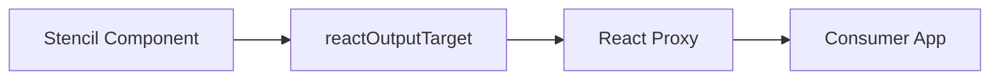
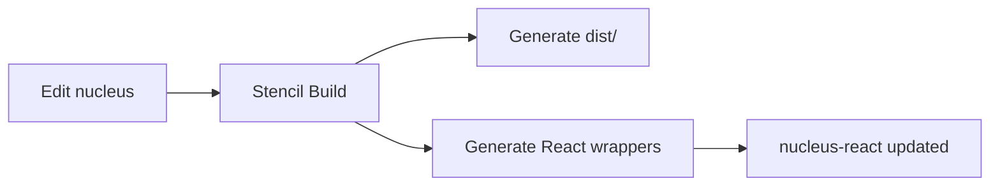

## The Web Component Integration Challenge

Web components work in React—you can render `<nucleus-button>` and it will display. But the developer experience is awkward without wrappers. You'd need to manually add event listeners, and TypeScript wouldn't know the props. React's synthetic event system doesn't automatically map to custom element events. The React output target solves this by generating React components that feel native.



## Configuring the React Output Target

In `stencil.config.ts`:

```typescript
import { reactOutputTarget } from '@stencil/react-output-target';

reactOutputTarget({
  componentCorePackage: 'nucleus',
  outDir: '../nucleus-react/lib/components/react-lib'
})
```

- **`componentCorePackage`**: The npm package name of your core Stencil library.
- **`outDir`**: Where to write generated React components. These files are overwritten on every build—never edit them manually.

## What Gets Generated

After `npm run build -w nucleus`, check `nucleus-react/lib/components/react-lib/`. You'll find TypeScript files like `NucleusButton.tsx`:

```typescript
export const NucleusButton = createReactComponent<
  JSX.NucleusButton,
  HTMLNucleusButtonElement
>('nucleus-button', undefined, undefined, defineCustomElement);
```

The `createReactComponent` helper: registers the custom element on first use, forwards refs correctly, converts Stencil events to React callback props, and provides full TypeScript types. You get proper JSX support and IntelliSense.

## Developer Experience: Before and After

**Without wrapper** (works but painful):

```tsx
<nucleus-button
  ref={(el) => el?.addEventListener('nucleusClick', handleClick)}
  type="primary"
>
  Click
</nucleus-button>
```

**With wrapper** (idiomatic React):

```tsx
<NucleusButton type="primary" onNucleusClick={handleClick}>
  Click
</NucleusButton>
```

Full TypeScript autocomplete, event handling as props, and refs work with `useRef()`.

## Event Mapping

Stencil custom events automatically become React props:

| Stencil Event | React Prop |
|---------------|------------|
| `nucleusChange` | `onNucleusChange` |
| `nucleusClick` | `onNucleusClick` |

The event detail is passed as the callback argument. For `nucleusChange`, you typically receive `event.detail` with the new value.

## Critical: defineCustomElements

Consumers must call `defineCustomElements()` once (e.g., in `main.tsx` or `App.tsx`) to register web components with the browser:

```tsx
import { defineCustomElements } from 'nucleus/loader';
defineCustomElements();
```

The React wrapper re-exports this for convenience. Without registration, `<nucleus-button>` would be an unknown HTML element.

## Build Flow



Every nucleus build regenerates the React wrappers. Downstream packages pick up changes via workspace symlinks. No manual sync required.

## Consumer Usage

```tsx
import { NucleusButton, NucleusInput, defineCustomElements } from 'nucleus-react';
import 'nucleus/dist/nucleus/nucleus.css';

defineCustomElements();

function App() {
  return (
    <>
      <NucleusButton type="primary">Submit</NucleusButton>
      <NucleusInput placeholder="Name" onNucleusChange={(e) => console.log(e.detail)} />
    </>
  );
}
```

Import the CSS for styles. The wrapper handles the rest.

## Tree-Shaking

With `includeImportCustomElements: true`, each React component imports only its custom element definition. Bundlers tree-shake unused components—importing only `NucleusButton` means only button code loads. No full-library bundle required.

## Next Steps

Part 7 covers the Angular output target—how Angular's module system, change detection, and form integration work with generated directives.
