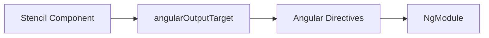
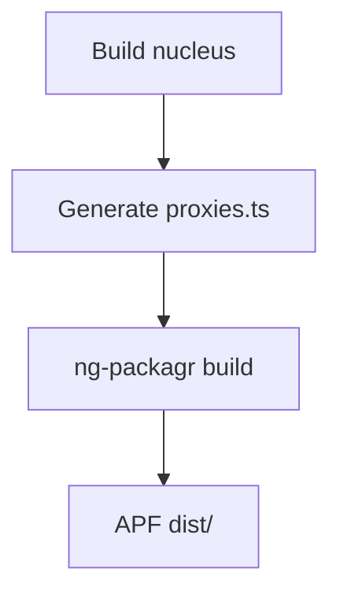

## Web Components in Angular

Angular has built-in support for custom elements. You can use `<nucleus-button>` in templates if you add `CUSTOM_ELEMENTS_SCHEMA` to your NgModule. But without a wrapper, you lose TypeScript validation, template binding syntax for events, and Angular Forms integration (ngModel, FormControl). The Angular output target generates proper directives that fix all of this.



## Configuring the Angular Output Target

In `stencil.config.ts`:

```typescript
import { angularOutputTarget } from '@stencil/angular-output-target';

angularOutputTarget({
  componentCorePackage: 'nucleus',
  outputType: 'component',
  directivesProxyFile: '../nucleus-angular/projects/nucleus-ng-component-library/src/lib/.../proxies.ts'
})
```

- **`directivesProxyFile`**: Path where Stencil writes generated directive code. This file is overwritten on every build.
- **`outputType: 'component'`**: Generates component-style directives (vs standalone for newer Angular).

## What Gets Generated

The generated `proxies.ts` contains Angular components that wrap the custom elements:

```typescript
@ProxyCmp({ inputs: ['type', 'size', 'rounded', 'disabled'] })
@Component({
  selector: 'nucleus-button',
  changeDetection: ChangeDetectionStrategy.OnPush,
  template: '<ng-content></ng-content>',
  standalone: false
})
export class NucleusButton {
  protected el: HTMLElement;
  constructor(/* ... */) {
    proxyOutputs(this, this.el, ['nucleusClick']);
  }
}
```

The `@ProxyCmp` decorator maps Stencil props to Angular inputs and forwards events to outputs. Content projection uses `<ng-content>`.

## Angular Module Setup

Consumers import `NucleusComponentLibraryModule`:

```typescript
@NgModule({
  imports: [
    BrowserModule,
    NucleusComponentLibraryModule
  ],
  // ...
})
export class AppModule {}
```

The module declares all generated directives and calls `defineCustomElements(window)` so web components register. Consumers don't need to add `CUSTOM_ELEMENTS_SCHEMA`—it's scoped to the library module.

## Forms Integration

For inputs, checkboxes, and other form controls, you can configure value accessors so `ngModel` and `formControlName` work:

```html
<nucleus-input [(ngModel)]="username" placeholder="Username"></nucleus-input>
```

With the right `valueAccessorConfigs` in the output target, Angular Forms bind correctly to the custom element's value and change events.

## Event Handling in Templates

```html
<nucleus-button type="primary" (nucleusClick)="onSubmit()">
  Submit
</nucleus-button>
```

Angular's event binding `(nucleusClick)` works like any other output. TypeScript preserves event typings.

## Build Process



The Angular library uses `ng-packagr` to compile to Angular Package Format. Build order: nucleus first, then nucleus-angular. Nx handles this via `dependsOn`.

## Standalone Component Support (Angular 14+)

For standalone components, import the directive directly:

```typescript
@Component({
  standalone: true,
  imports: [NucleusButton],
  template: '<nucleus-button type="primary">Click</nucleus-button>'
})
export class LoginComponent {}
```

## Change Detection

Generated directives use `ChangeDetectionStrategy.OnPush` for performance. They re-check only when inputs change. Zone.js ensures custom element attribute updates still trigger detection when needed.

## Next Steps

Part 8 covers Storybook setup for React—configuring the dev server, loading global styles, and organizing stories by Atomic Design.
