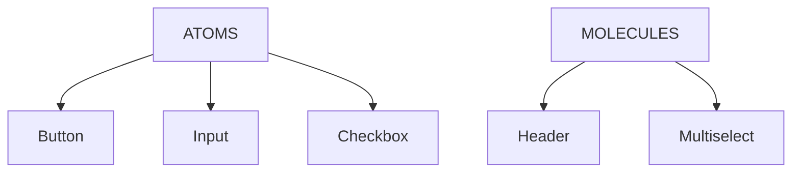

## Why Storybook for Design Systems?

Storybook is the industry standard for component documentation. It lets you view components in isolation, tweak props in real time, and auto-generate API docs from TypeScript. Designers and QA can explore components without running the full app. Major design systems (Material-UI, Carbon, Ant Design) use Storybook as their primary docs tool.

For Nucleus, we run two Storybooks—one for React and one for Angular—so each framework's developers see usage examples in their preferred syntax.

## Project Structure

```
packages/sb-nucleus-react/
├── .storybook/
│   ├── main.ts       # Storybook config, addons, framework
│   └── preview.ts    # Global decorators, parameters, CSS
├── src/stories/
│   ├── ATOMS/        # Button, Input, Checkbox, etc.
│   ├── MOLECULES/    # Header, Footer, Multiselect
│   └── ELEMENTS/     # Login page, Dashboard
└── package.json
```

## Critical: preview.ts Configuration

The preview file sets up requirements shared by all stories:

```typescript
import { defineCustomElements } from 'nucleus/loader';
import 'nucleus/dist/nucleus/nucleus.css';

defineCustomElements();

export const parameters = {
  controls: { expanded: true },
  options: {
    storySort: { order: ['ATOMS', 'MOLECULES', 'ELEMENTS'] }
  }
};
```

**Two essential lines**:

1. **`defineCustomElements()`**: Registers all Nucleus web components. Without this, `<nucleus-button>` is unknown HTML.
2. **`import 'nucleus/dist/nucleus/nucleus.css'`**: Loads design tokens and component styles. Without this, components render unstyled.

## Story Structure (CSF3)

Stories use Component Story Format 3:

```typescript
import type { Meta, StoryObj } from '@storybook/react';
import { NucleusButton } from 'nucleus-react';

const meta: Meta<typeof NucleusButton> = {
  title: 'ATOMS/Button',
  component: NucleusButton,
  tags: ['autodocs'],
  argTypes: {
    type: { control: 'select', options: ['primary', 'secondary'] },
    size: { control: 'select', options: ['xs', 'sm', 'md', 'lg', 'xl'] },
    rounded: { control: 'boolean' }
  }
};

export default meta;
type Story = StoryObj<typeof NucleusButton>;

export const Primary: Story = {
  args: { type: 'primary', children: 'Primary Button' }
};

export const Secondary: Story = {
  args: { type: 'secondary', children: 'Secondary Button' }
};
```

- **`title`**: Determines sidebar location. `ATOMS/Button` nests under ATOMS.
- **`tags: ['autodocs']`**: Auto-generates a Docs tab with prop tables.
- **`argTypes`**: Configures Controls panel (select, boolean, text).
- **Named exports**: Each is a story variant.

## Storybook Categories



Users see this hierarchy in the sidebar. Build from atoms upward.

## Running Storybook

**Development**:

```bash
npm run storybook -w sb-nucleus-react
```

Starts dev server (typically http://localhost:6006) with hot reload.

**Production build**:

```bash
npm run build-storybook -w sb-nucleus-react
```

Outputs to `storybook-static/`—a static SPA deployable to any host.

## Common Gotcha: Styles Not Loading

If components render but look unstyled, you forgot to import the CSS in `preview.ts`. Web components don't bundle their own styles when using global styles—consumers (including Storybook) must import `nucleus.css`.

## Next Steps

Part 9 covers the Angular Storybook—Compodoc integration, module metadata, and Angular-specific story patterns.
