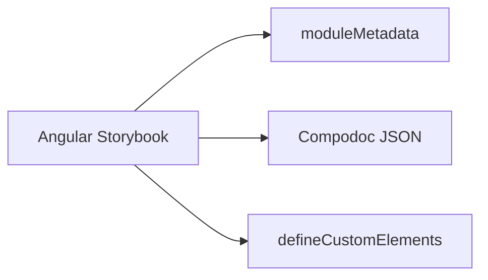

## Angular Storybook Differences

React Storybook imports components directly. Angular Storybook must account for NgModules, dependency injection, and change detection. The `@storybook/angular` package handles these. The main differences: you provide `moduleMetadata` so stories have access to your modules, and you use Compodoc for API docs instead of Stencil's generated docs.



## Critical: preview.ts for Angular

```typescript
import { setCompodocJson } from '@storybook/addon-docs/angular';
import { moduleMetadata } from '@storybook/angular';
import { defineCustomElements } from 'nucleus/loader';
import docJson from '../documentation.json';

setCompodocJson(docJson);
defineCustomElements(window);

export const decorators = [
  moduleMetadata({
    imports: [CommonModule, NucleusComponentLibraryModule]
  })
];
```

**Key pieces**:

1. **`setCompodocJson(docJson)`**: Loads Angular API metadata. Compodoc generates `documentation.json` from your Angular library.
2. **`moduleMetadata`**: Makes `NucleusComponentLibraryModule` available to every story. Without it, Angular doesn't recognize `nucleus-button`.
3. **`defineCustomElements(window)`**: Registers web components.

## Compodoc Setup

Compodoc generates API documentation from Angular decorators and JSDoc. Add to `package.json`:

```json
{
  "scripts": {
    "compodoc": "compodoc -p tsconfig.json -e json -d .",
    "storybook": "npm run compodoc && storybook dev -p 6007"
  }
}
```

Run `compodoc` before Storybook so `documentation.json` exists. Storybook's docs addon uses it for the ArgsTable and API panels.

## Angular Story Format

Stories use templates instead of JSX:

```typescript
const meta: Meta = {
  title: 'ATOMS/Button',
  render: (args) => ({
    props: args,
    template: `
      <nucleus-button
        [type]="type"
        [size]="size"
        [rounded]="rounded"
        [disabled]="disabled"
        (nucleusClick)="onClick()"
      >
        {{ label }}
      </nucleus-button>
    `
  }),
  argTypes: {
    type: { control: 'select', options: ['primary', 'secondary'] },
    label: { control: 'text' }
  }
};

export const Primary: Story = {
  args: { type: 'primary', label: 'Primary Button' }
};
```

- **Property binding**: `[type]="type"` for inputs.
- **Event binding**: `(nucleusClick)="onClick()"` for outputs.
- **Interpolation**: `{{ label }}` for text.

## Global Styles

In `src/styles.css` or `main.ts` styles array:

```css
@import 'nucleus/dist/nucleus/nucleus.css';
```

Reference this in Storybook config so it loads for all stories. Without it, components render unstyled.

## Storybook Port

React and Angular Storybooks use different ports to run simultaneously (e.g., 6006 for React, 6007 for Angular). Configure in `package.json` or Storybook config.

## Combined Bundle for Deployment

For production, both Storybooks are built and combined into one deployable package. Users see an index page with links to React and Angular docs. The `prepare-storybook-webapp-package.cjs` script handles this.

## Next Steps

Part 10 explains Atomic Design—how to categorize components as atoms, molecules, and elements, and why that structure matters for Storybook and maintainability.
