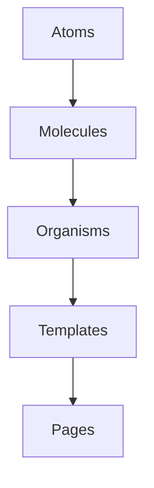
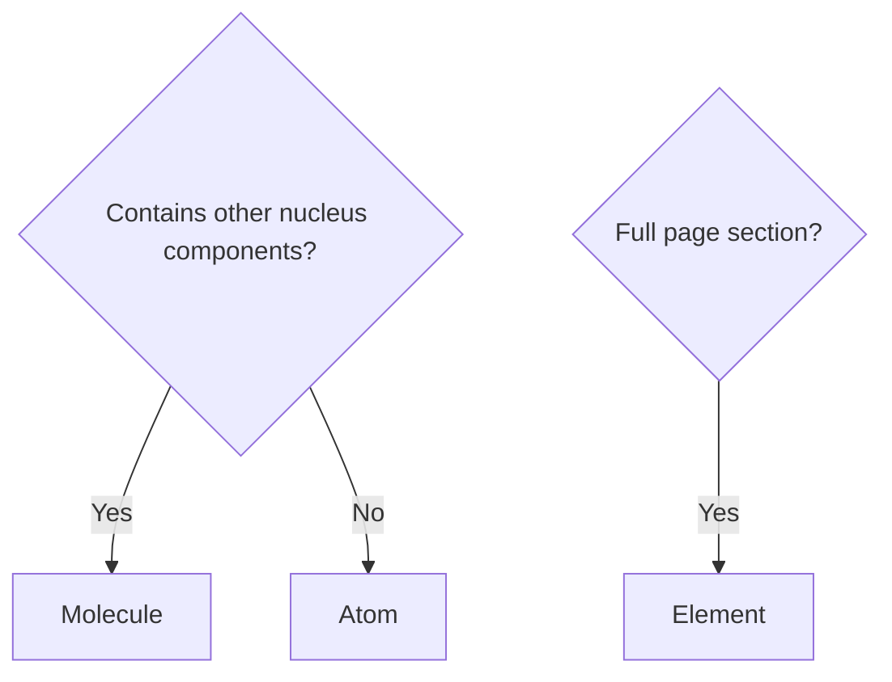

## What is Atomic Design?

Atomic Design, coined by Brad Frost, breaks interfaces into hierarchical building blocks—like atoms in chemistry. Atoms are the smallest units; molecules combine atoms; organisms combine molecules; templates and pages assemble organisms. This mental model helps teams understand dependencies, organize codebases, and communicate with a shared vocabulary.



For Nucleus, we use a simplified set: **ATOMS**, **MOLECULES**, and **ELEMENTS** (our term for page-level compositions). This is enough structure without over-complicating.

## Atoms: UI Primitives

**Definition**: Indivisible, single-purpose elements. They don't contain other Nucleus components.

**Nucleus examples**: `nucleus-button`, `nucleus-input`, `nucleus-checkbox`, `nucleus-radio`, `nucleus-pill`, `nucleus-avatar`, `nucleus-progress`, `nucleus-toggle`, `nucleus-textarea`, `nucleus-dropdown`.

**Characteristics**:
- Highly reusable
- Map roughly 1:1 to HTML elements (button, input, img)
- Accept props but little internal state

**When to create an atom**: When you need a styled, reusable version of a standard UI primitive used across the app.

## Molecules: Simple Compositions

**Definition**: Groups of atoms that function together as a unit.

**Nucleus examples**: `nucleus-header` (logo + nav + buttons), `nucleus-footer`, `nucleus-multiselect` (input + dropdown + pills), `nucleus-accordion` (header + body).

**Characteristics**:
- Composed of 2+ atoms
- Single focused purpose
- Encapsulate pattern logic (e.g., multiselect managing selected items)

**When to create a molecule**: When 2+ atoms consistently appear together and benefit from shared logic.

## Elements (Page-Level Compositions)

**Definition**: Full UI sections that show how molecules and atoms combine into complete screens. In Nucleus we call these ELEMENTS to avoid confusion with Angular's concept of "elements."

**Examples**: Login Page (form inputs + button + header), Dashboard (metrics + navigation).

These are often built as Storybook "stories" or example pages, not always as separate Stencil components.

## Decision Framework



**Is it an atom or molecule?** If it contains other Nucleus components, it's a molecule. Otherwise, atom.

**Is it a molecule or element?** If it represents a full page section or workflow, it's an element. If it's a reusable pattern, molecule.

## Storybook Implementation

Category drives the story `title`:

```typescript
// Atom
title: 'ATOMS/Button'

// Molecule
title: 'MOLECULES/Header'

// Element
title: 'ELEMENTS/Login Page'
```

The `storySort.order` in `preview.ts` enforces sidebar order: `['ATOMS', 'MOLECULES', 'ELEMENTS']`. Developers navigate from simple to complex.

## Benefits for Junior Developers

- **Clear location**: "I need a button" → check ATOMS.
- **Understand dependencies**: Atoms have none; molecules depend on atoms.
- **Implementation order**: Build atoms first, then molecules.
- **Shared vocabulary**: Designers and developers use the same terms.

## Anti-Patterns

**Don't over-categorize**: If you're debating for more than a few minutes, pick one and move on.

**Don't create atoms for everything**: Not every styled div needs to be a component. Atoms are for reusable primitives.

**Don't couple atoms to molecules**: Atoms should never import molecules. Dependency flow is one-way.

## Next Steps

Part 11 dives deeper into design tokens—semantic aliases, theming, and consumer overrides without recompiling.
