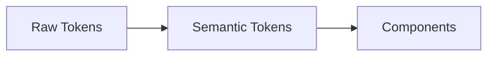

## Beyond Basic Tokens

Part 5 introduced the three-tier architecture. Here we go deeper: semantic tokens, theme switching, and how consumers customize without forking. If you're new to tokens, think of semantic tokens as "aliases with meaning"—instead of `blue-500`, you use `color-primary` so the value can change by theme (light/dark) or brand.

## Token Hierarchy: Raw vs Semantic



**Raw tokens**: Context-free values like `$blue-500: #3b82f6`. Same everywhere.

**Semantic tokens**: Aliases that reference raw tokens, e.g., `$color-primary: $blue-500`. These can change by theme—in dark mode, `color-primary` might map to a different raw value.

## Theme Switching with data-theme

Nucleus implements theming via CSS custom property overrides:

```scss
:root {
  --nucleus-color-background: #f3f4f6;
  --nucleus-color-text: #111827;
}

[data-theme="dark"] {
  --nucleus-color-background: #1f2937;
  --nucleus-color-text: #f9fafb;
}
```

**Runtime toggle**:

```javascript
document.documentElement.setAttribute('data-theme', 'dark');
```

All components update instantly. No rebuild, no prop drilling, no React Context. The cascade does the work.

## Consumer Overrides

Consumers can rebrand without forking your library:

```css
:root {
  --nucleus-color-primary: #e63946;
  --nucleus-font-family-sans: 'Inter', sans-serif;
}
```

Import this CSS after `nucleus.css`. The cascade ensures consumer values override yours. Essential for white-label products or A/B theming.

## Token Organization

Nucleus organizes by category:

```
tokens/
├── _colors.scss
├── _spacing.scss
├── _typography.scss
├── _borders.scss
├── _shadows.scss
├── _transitions.scss
└── _z-index.scss
```

**By category** (Nucleus): Easy to find all colors in one place. Slight downside: button tokens (color + spacing + border) are spread across files.

**By component**: E.g., `_button-tokens.scss`. All button tokens together, but duplicate shared values. Use category-based for shared tokens; component-specific only when a token is used by one component.

## Responsive Tokens

Tokens can vary by viewport:

```scss
:root {
  --nucleus-spacing-page-margin: 16px;
  
  @media (min-width: 768px) {
    --nucleus-spacing-page-margin: 32px;
  }
}
```

Components using this token adapt automatically. No media queries in component SCSS.

## Token Validation: Systematic Scales

Avoid arbitrary values. Use systematic scales:

**Bad**: `$spacing-1: 7px;` (why 7?)

**Good**: `$spacing-xs: 4px;` `$spacing-sm: 8px;` `$spacing-md: 16px;`

Scales ensure visual rhythm. Designers and developers can predict values.

## Multi-Brand Strategy (Advanced)

For orgs with multiple brands, use compile-time overrides:

```scss
$brand: 'coca-cola' !default;

@if $brand == 'coca-cola' {
  $color-primary: #f40009;
} @else if $brand == 'sprite' {
  $color-primary: #00af3f;
}
```

Build separate bundles: `BRAND=sprite npm run build`. Same components, different tokens.

## Token Versioning

When tokens change, treat them like API:

- **Patch**: New token added (backward compatible)
- **Minor**: Token renamed (deprecate old, support new)
- **Major**: Token removed or behavior changed (breaking)

## Next Steps

Part 12 covers Stencil's auto-generated documentation—JSDoc, docs-json, and integration with Storybook.
