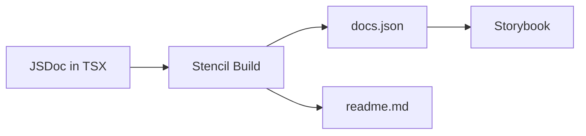

## The Documentation Challenge

Manual documentation drifts. Props change, developers forget to update docs, and you end up with code and docs saying different things. The solution: generate documentation from code. Stencil provides built-in tools so your API docs stay accurate without extra effort.



## Stencil's --docs Flag

When you run `stencil build --docs`, Stencil extracts metadata from your components and generates documentation. The `--docs` flag enables:

- **Property tables**: Derived from `@Prop()` decorators and TypeScript types
- **Event tables**: From `@Event()` declarations
- **Method tables**: From `@Method()` if used

Each component gets a `readme.md` in its folder with an auto-generated API section.

## Enhancing Docs with JSDoc

JSDoc comments improve the generated output:

```typescript
/**
 * Visual style variant for the button.
 * - `primary`: Solid background, high emphasis
 * - `secondary`: Outlined, medium emphasis
 */
@Prop() type: 'primary' | 'secondary' = 'primary';

/**
 * Emitted when the button is clicked.
 */
@Event() nucleusClick: EventEmitter<void>;
```

These appear in the property table, Storybook autodocs, and IDE tooltips. A few lines of JSDoc make a big difference for consumers.

## docs-json Output Target

Add to `stencil.config.ts` for machine-readable output:

```typescript
{
  type: 'docs-json',
  file: 'dist/docs.json'
}
```

After build, `dist/docs.json` contains structured data for all components. Tools can consume this for custom doc generators or API portals.

## docs-readme Output Target

Stencil can generate `readme.md` per component:

```typescript
{
  type: 'docs-readme',
  dir: 'src/components'
}
```

The readme includes a property table and events table. Content above `<!-- Auto Generated Below -->` is preserved; Stencil only regenerates the API section.

## Storybook Autodocs Integration

With `tags: ['autodocs']` on your Storybook meta, Storybook generates a Docs tab. It uses TypeScript types and, when configured, can pull from Stencil's docs. The result: a live props table with controls, code examples, and event documentation—all driven by your source code.

## Writing Effective JSDoc

**Good**:

```typescript
/**
 * Size variant affecting padding and font size.
 * - `small`: Compact for dense UIs
 * - `medium`: Default, balanced
 * - `large`: Prominent actions
 */
@Prop() size: 'small' | 'medium' | 'large' = 'medium';
```

**Poor**:

```typescript
/** The size */
@Prop() size: string;
```

Good docs explain what the prop controls, when to use each value, and how it affects the component.

## Angular: Compodoc Instead

For Angular Storybook, Compodoc generates `documentation.json` from Angular decorators. Use `setCompodocJson()` in preview to feed it to Storybook. Stencil's docs apply to the core; Compodoc applies to the Angular wrapper layer.

## Verification

After build:

```bash
test -f packages/nucleus/dist/docs.json && echo "docs.json exists"
test -f packages/nucleus/src/components/nucleus-button/readme.md && echo "README updated"
```

## Next Steps

Part 13 covers monorepo tooling—Nx caching, Biome for linting/formatting, and CI pipelines for automated validation.
