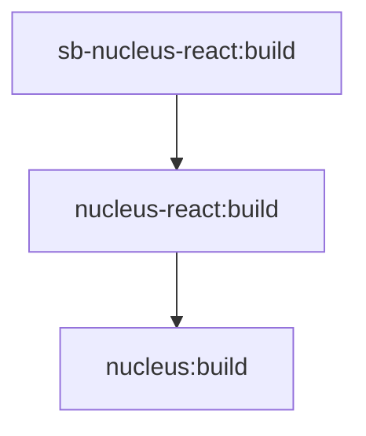
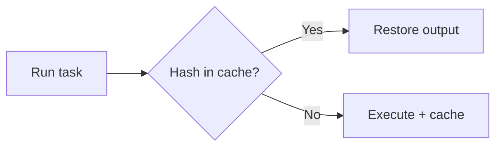

## The Monorepo Tooling Challenge

As monorepos grow, three problems emerge: slow builds, inconsistent code style, and broken dependency order. Nx, Biome, and CI automation address these. For junior developers, the main takeaway: run `npm run build` from the root and let Nx figure out what to build and in what order.

## Nx: Task Graphs and Dependencies

Nx reads `package.json` dependencies and `nx.json` to build a task graph:



When you run `nx build sb-nucleus-react`, Nx builds `nucleus` first, then `nucleus-react`, then `sb-nucleus-react`. The `^build` in `dependsOn` means "build all dependencies first."

## Computation Caching

Nx hashes task inputs (source files, config, environment) to create a cache key. If you've run the same task before with the same inputs, Nx restores output from cache instead of re-running. Your second build after no changes can complete in seconds.



On CI, this compounds. If only `nucleus-button` changed, only affected packages rebuild; others restore from cache.

## Affected Command

For CI, run only affected packages:

```bash
nx affected --target=build --base=main
```

This builds packages touched by changes since `main`. Unchanged packages are skipped. For large repos and frequent PRs, this saves significant time.

## Biome: Unified Linter and Formatter

Biome is a Rust-based tool that replaces ESLint and Prettier. One config, one binary, much faster. Configure `biome.json` at the repo root:

```json
{
  "formatter": {
    "enabled": true,
    "indentWidth": 2,
    "lineWidth": 100
  },
  "linter": {
    "enabled": true,
    "rules": { "recommended": true }
  }
}
```

**Commands**:

- `npm run lint`: Lint all packages
- `npm run lint:fix`: Auto-fix where possible
- `npm run format`: Format all files

Biome runs across the workspace. Per-package overrides are supported for special cases.

## CI Pipeline Outline

A typical GitHub Actions workflow:

```yaml
- run: npm ci
- run: npx nx affected --target=lint --base=origin/main
- run: npx nx affected --target=build --base=origin/main
- run: npx nx affected --target=test --base=origin/main
```

Key details: `fetch-depth: 0` for full git history (needed for affected calculation), `cache: 'npm'` to cache `node_modules`, and run affected targets so only changed code is validated.

## Pre-commit Hooks (Optional)

Tools like Husky and lint-staged can run Biome on staged files before each commit. Prevents bad code from entering the repo. Configuration lives in `.husky/pre-commit` and `lint-staged` in `package.json`.

## Debugging Nx

- **`nx graph`**: Opens a visual dependency graph in the browser
- **`nx build nucleus --verbose`**: Shows why a task ran or was skipped, cache hits/misses

## Anti-Patterns

**Don't**: Run `npm install` in individual packages. Use root only.

**Don't**: Commit `node_modules`, `dist/`, or `.nx/cache`.

**Do**: Run `npm run lint` and `npm run build` before opening PRs.

## Next Steps

Part 14 covers deployment—building protected Storybook bundles, Azure Bicep infrastructure, and deploying to Azure Web App.
