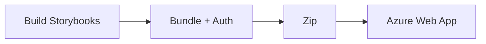

## Deployment Strategy Overview

Design systems typically publish two artifacts: **npm packages** (for developers) and **documentation** (for designers and stakeholders). Nucleus deploys a protected Storybook bundle to Azure Web App with basic authentication so documentation stays private during development. When ready for public release, you can switch to unauthenticated hosting.



## The Bundled Storybook Architecture

Rather than two separate sites, we combine React and Angular Storybooks into one deployable package:

1. Build both Storybooks to static output
2. Combine into one directory with an index page
3. Add a Node.js authentication server
4. Zip and deploy to Azure

The bundle includes React Storybook, Angular Storybook, and an Express server that serves both behind basic auth.

## Building the Bundle

```bash
npm run build-storybook:bundle
```

This script:

1. Cleans previous builds
2. Builds React Storybook → `storybook-static/`
3. Builds Angular Storybook → `storybook-static/`
4. Runs `prepare-storybook-webapp-package.cjs` to combine outputs, add auth server, and create `.deploy/storybook-webapp.zip`

## Authentication Server

The `serve-storybook-bundle-auth.cjs` script uses Express and `express-basic-auth` to protect all routes. Credentials come from environment variables (`SB_USER`, `SB_PASS`). Set these in Azure App Settings so the server reads them at runtime.

## Azure Infrastructure with Bicep

Bicep is Azure's infrastructure-as-code language. The `infra/` folder contains:

```
infra/
├── main.bicep           # Entry point, parameters
├── params/
│   ├── dev.bicepparam   # Dev environment values
│   └── prod.bicepparam  # Prod values
└── modules/
    ├── app-service-plan.bicep
    ├── web-app.bicep
    └── app-insights.bicep
```

**Deploy infrastructure**:

```bash
npm run deploy:storybook:infra
```

This runs `az deployment group create` with the Bicep template. Azure creates an App Service Plan, Web App (Node.js 20), and Application Insights. Idempotent—re-running updates existing resources.

## Application Deployment

After infrastructure exists:

```bash
npm run deploy:storybook:app
```

This builds the bundle, creates the zip, and runs `az webapp deploy` to push the zip to the Web App. Azure extracts it, runs `npm install`, and starts the auth server. Your Storybook is live at the Web App URL.

## Environment Variables

Set via Azure CLI or Portal:

```bash
az webapp config appsettings set \
  --resource-group nucleus-design-system \
  --name $AZURE_WEBAPP_NAME \
  --settings SB_USER=admin SB_PASS=securepassword
```

The auth server reads these at startup.

## First-Time Full Deploy

```bash
npm run deploy:storybook
```

Runs infra deploy followed by app deploy. Use for initial setup or when both need updating.

## Publishing npm Packages (When Ready)

When publishing to npm:

1. Bump versions: `npm version patch` in each package
2. Publish order: `nucleus` → `nucleus-react` → `nucleus-angular` (dependency order)
3. Use `npm publish --access public` for scoped packages

Tools like Changesets can automate versioning and changelogs across packages.

## Next Steps

Part 15 provides a complete reference of the project structure—what every directory and key file does.
