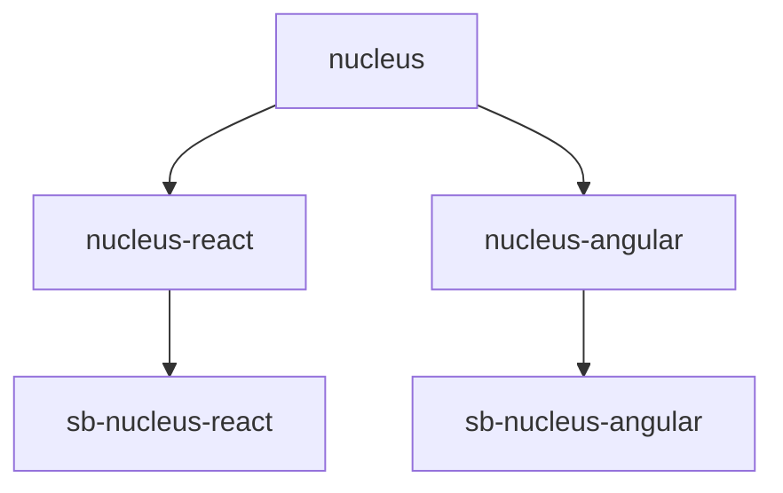

## Repository Root

```
nucleus/
├── packages/         # All npm workspace packages
├── infra/            # Azure Bicep templates
├── scripts/          # Build and deploy helpers
├── docs/             # This Jekyll blog
├── package.json      # Workspaces, root scripts
├── nx.json           # Nx task defaults
└── biome.json        # Linting and formatting
```

## Package Dependency Graph



Build order flows from bottom to top of this graph: nucleus first, then wrappers, then Storybooks.

## packages/nucleus — Core Library

```
nucleus/
├── src/
│   ├── components/       # Stencil components (nucleus-button, etc.)
│   │   └── nucleus-button/
│   │       ├── nucleus-button.tsx
│   │       ├── nucleus-button.scss
│   │       └── nucleus-button.spec.tsx
│   ├── styles/
│   │   ├── tokens/       # SCSS variables
│   │   ├── mixins/
│   │   ├── _custom-properties.scss
│   │   └── styles.scss
│   └── index.ts
├── stencil.config.ts
└── package.json
```

**Key files**: `stencil.config.ts` (output targets, plugins), `styles/styles.scss` (global entry), `styles/tokens/` (design tokens).

## packages/nucleus-react — React Wrapper

```
nucleus-react/
├── lib/components/react-lib/   # Auto-generated (do not edit)
├── dist/
└── package.json
```

Stencil regenerates `lib/` on every nucleus build. The package compiles TypeScript to `dist/`.

## packages/nucleus-angular — Angular Wrapper

```
nucleus-angular/
├── projects/nucleus-ng-component-library/
│   └── src/lib/
│       ├── proxies.ts      # Auto-generated directives
│       └── ...
├── dist/
└── angular.json
```

`proxies.ts` is auto-generated. Build with `ng-packagr` to produce APF output.

## packages/sb-nucleus-react & sb-nucleus-angular

Storybook packages. Critical: `preview.ts` must import `nucleus.css` and call `defineCustomElements()`. Angular Storybook also needs Compodoc and `moduleMetadata`.

## scripts/

- **`prepare-storybook-webapp-package.cjs`**: Combines React + Angular Storybook builds, adds auth server, creates zip.
- **`serve-storybook-bundle-auth.cjs`**: Express server with basic auth for the bundled Storybook.

## infra/

- **`main.bicep`**: Root template. Parameters: location, webAppName, sbUser, sbPass.
- **`modules/`**: app-service-plan, web-app, app-insights.
- **`params/`**: dev.bicepparam, prod.bicepparam for environment-specific values.

## Key Commands

| Command | Purpose |
|---------|---------|
| `npm run build` | Build all packages (Nx order) |
| `npm run lint` | Lint all |
| `npm run format` | Format all |
| `npm run storybook` | Start both Storybooks |
| `npm run build-storybook:bundle` | Build combined Storybook for deploy |
| `npm run deploy:storybook` | Full infra + app deploy |

## File Naming Conventions

- Components: `nucleus-{name}.tsx`
- Styles: `nucleus-{name}.scss`
- Tests: `nucleus-{name}.spec.tsx`
- Stories: `{Name}.stories.tsx` or `.ts`

## Gitignore

`node_modules/`, `dist/`, `.nx/cache/`, `.deploy/`, `storybook-static/` are ignored. Never commit build artifacts.

---

You now have a complete reference for navigating Nucleus. Return to earlier parts for deep dives on specific topics. The structure should feel intuitive: core → wrappers → documentation, with shared tooling and infra at the root.
