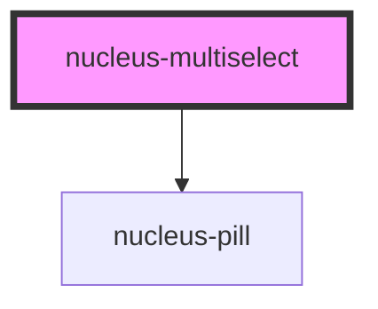

# nucleus-multiselect

<!-- Auto Generated Below -->

## Properties

| Property      | Attribute     | Description | Type       | Default            |
| ------------- | ------------- | ----------- | ---------- | ------------------ |
| `options`     | --            |             | `string[]` | `[]`               |
| `placeholder` | `placeholder` |             | `string`   | `"Select options"` |
| `value`       | --            |             | `string[]` | `[]`               |

## Events

| Event         | Description | Type                    |
| ------------- | ----------- | ----------------------- |
| `valueChange` |             | `CustomEvent<string[]>` |

## Dependencies

### Depends on

- [nucleus-pill](../nucleus-pill)

### Graph

----------------------------------------------

*Built with [StencilJS](https://stenciljs.com/)*
