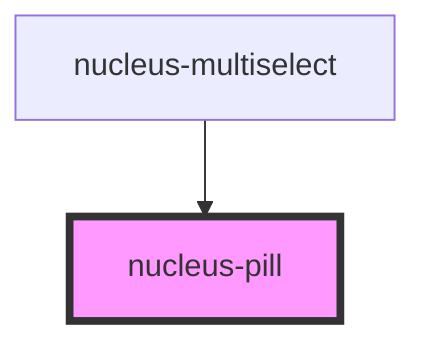

# nucleus-pill

<!-- Auto Generated Below -->

## Properties

| Property    | Attribute   | Description | Type                       | Default     |
| ----------- | ----------- | ----------- | -------------------------- | ----------- |
| `closed`    | `closed`    |             | `boolean`                  | `false`     |
| `removable` | `removable` |             | `boolean`                  | `true`      |
| `shape`     | `shape`     |             | `"rectangle" \| "rounded"` | `"rounded"` |
| `type`      | `type`      |             | `"primary" \| "secondary"` | `"primary"` |

## Events

| Event       | Description | Type                |
| ----------- | ----------- | ------------------- |
| `pillClose` |             | `CustomEvent<void>` |

## Dependencies

### Used by

 - [nucleus-multiselect](../nucleus-multiselect)

### Graph

----------------------------------------------

*Built with [StencilJS](https://stenciljs.com/)*
